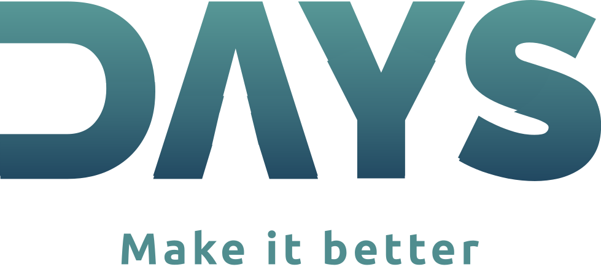

 
 

## The project 🔧
Days is a modern school management ecosystem that allows the student to have a deeper connection with the system itself, since all the information that he/she needs is on their mobile app.

Besides providing a clean and modern UI, Days shows the student relevant information like:
* Schedule
* Tests
* Average of all three high school years
* Among others...

 

## Why? 🧐

I started prototyping Days as a actual product for a company I had with a friend of mine, but when the opportunity came I decided to use this as my final school project, which has a pretty have percentage in my global evaluation.

 

## Suggestions? 💡
If you have any suggestion you can always e-mail it to me at <code>miguel.personal@protonmail.com</code> or at <code>t.me/esfoliante</code>.
I would love to get feedback!

 

## Wanna help me? 

Made with 💙 by **Miguel Ferreira**
